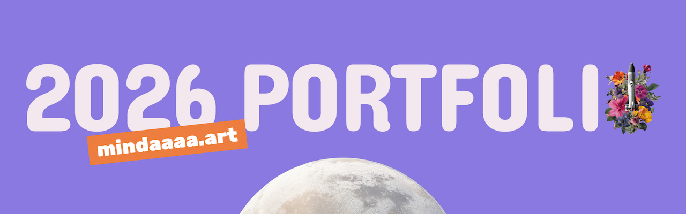

<div align="center">



</div>

<div align="center">

<br>

> **상황에 맞는 선택을 하는 개발자,  
> 민정의 작업과 배움을 기록한 포트폴리오**

🌐 **[mindaaaa.art](https://mindaaaa.art)**


</div>

---

## 👋 About

포트폴리오는 단순한 결과물 나열이 아니라, _어떤 맥락에서 어떤 선택을 했는가_ 를 보여주는 공간이라고 생각합니다.

이 사이트는 지난 시간 동안 쌓아온 프로젝트와 활동을, 당시의 고민과 함께 되짚어볼 수 있도록 설계했습니다.  
방문해주시는 분이 저라는 사람을 조금 더 입체적으로 이해하실 수 있기를 바라며 만들었습니다.

---

## 💼 섹션 구성

사이트는 **3개의 섹션**으로 구성됩니다.

- **About** — 패럴랙스 레이어로 흘러가는 자기소개. 3페이지 구성
- **Projects** — 벤토그리드 기반의 프로젝트 전시. 카드 클릭 시 상세 페이지로 전환
- **Activities** — 색상별로 겹쳐진 카드 스택. 각 활동에서의 배움과 인사이트

<div align="center">
  


</div>

---

## 🛠️ 기술 스택

<div align="center">

### 💻 Core


### 🎨 UI & Animation


### 🔧 State & Routing


### 🚀 Deploy


</div>

---

## 🎨 디자인 노트

- **글라스모피즘** 기반의 UI — 반투명 레이어와 배경 블러의 겹침
- **패럴랙스 인터랙션** — About 섹션의 배경/에셋/텍스트를 레이어 단위로 분리
- **Framer Motion `layoutId`** — Projects 카드 → 상세 페이지의 자연스러운 이어짐
- **성능 우선** — `backdrop-filter`와 3D transform 동시 사용을 피하는 식의 세부 최적화

---

## 🚀 Quick Start

```bash
pnpm install
pnpm dev
```

| 스크립트         | 설명                |
| ---------------- | ------------------- |
| `pnpm dev`       | 로컬 개발 서버 실행 |
| `pnpm build`     | 프로덕션 빌드       |
| `pnpm serve`     | 빌드 결과 미리보기  |
| `pnpm typecheck` | 타입 검사           |

---

## 📫 Contact

<div align="center">

<a href="https://github.com/mindaaaa"></a>
<a href="https://404minda.tistory.com/"></a>
<a href="mailto:devalc735@gmail.com"></a>

</div>

<div align="center">

<br>

> _생각하는 것, 만드는 것, 그리고 그 사이의 선택들._

Made with 🌱 by **Minda**

</div>
